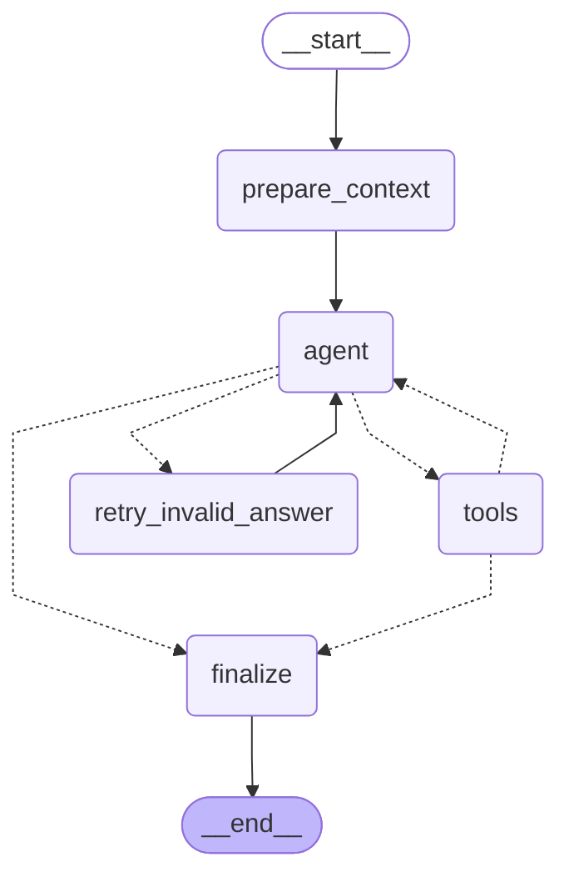

# GAIA LangGraph Agent

> **Documento de estudio para programadores que empiezan con agentes de IA.**
> Si encontrás un término que no conocés, buscalo primero en el [Glosario](#glosario) al final de esta página.

## Resumen

Este proyecto implementa un agente para el benchmark GAIA (conjunto de preguntas de evaluación para agentes de IA) usando un `StateGraph` de LangGraph relativamente pequeño, pero reforzado con bastante lógica determinística alrededor del estado, las fuentes y la finalización.

La idea central **no es "dejar que el modelo haga todo"**: se usa el LLM como planificador y lector, mientras que el código Python impone restricciones de seguridad (guardrails), ordenamiento de evidencias por confianza (ranking) y extractores determinísticos (reducers) cuando la respuesta puede obtenerse sin otra llamada al modelo.

Como caso de estudio de LangGraph, este repo es útil porque separa bastante bien tres capas:

1. **Orquestación del grafo** en `graph/workflow.py` — define el flujo general de nodos
2. **Clasificación de preguntas y normalización de evidencia** en `source_pipeline/` — analiza qué tipo de pregunta es y qué calidad tienen las fuentes
3. **Extracción determinística** desde prompt o evidencia estructurada en `reducers/` — intenta sacar la respuesta con código Python puro, sin el modelo

## Arquitectura general

El flujo visible empieza en la CLI (_command-line interface_, la herramienta de línea de comandos) de `cli.py`, que:

- carga variables de entorno
- consulta la API de GAIA con `api_client.py`
- descarga archivos adjuntos cuando existen
- instancia `GaiaGraphAgent`
- llama `solve(question, local_file_path=...)`

La separación entre ejecución y presentación está en `runner.py`, mientras que la observabilidad (poder ver qué hace el agente internamente) se maneja por medio de hooks (`hooks.py`) en vez de monkeypatching.

> **¿Qué es un hook?** Es una función que el sistema llama automáticamente en ciertos momentos clave (por ejemplo, antes y después de cada tool). Es como suscribirse a eventos sin modificar el código que los dispara. El monkeypatching era la alternativa anterior: modificar funciones ya existentes en memoria durante la ejecución, lo cual es más frágil y difícil de rastrear.

`solve()` tiene dos caminos:

- Primero intenta un **`prompt_reducer`** mínimo: un extractor limitado a respuestas que se pueden derivar solo del texto de la pregunta, sin consultar ninguna fuente externa. Hoy ese camino rápido (_fast-path_) cubre tablas o estructuras ya incluidas en la propia pregunta, como `non_commutative_subset`.
- Si ese extractor no aplica, invoca el `StateGraph` compilado y devuelve un resultado enriquecido con `tool_trace`, `decision_trace`, `evidence_used`, `reducer_used` y `fallback_reason`.

> **Importante:** el repo ya no considera "determinístico" ningún conocimiento embebido directamente en Python (como diccionarios de datos fijos). La decodificación de texto invertido sigue existiendo, pero como normalización de input (para que el modelo lea mejor), no como resolvedor. La lógica determinística más fuerte vive _después_ de recolectar evidencia, dentro de reducers y rescates orientados a fuentes concretas.

## Mapa de módulos

### `graph/` — Núcleo del workflow

Antes era un único `graph.py` monolítico (todo en un solo archivo enorme). Ahora está partido en módulos con responsabilidades claras:

| Módulo             | Responsabilidad                                                                           |
| ------------------ | ----------------------------------------------------------------------------------------- |
| `workflow.py`      | `GaiaGraphAgent`, compilación del `StateGraph`, nodos principales, `solve()`              |
| `state.py`         | `AgentState` — el estado compartido entre nodos, con campos de control y auditoría        |
| `contracts.py`     | Protocolos chicos para evidencia, ranking, ejecucion de tools y finalizacion              |
| `services.py`      | Implementacion concreta que compone esas interfaces sin exponer un service locator unico  |
| `tool_policy.py`   | Coordinador del nodo `tools`; aplica politicas, followups y actualizacion de candidatos   |
| `finalizer.py`     | Arbitraje final de respuesta apoyado en servicios de evidencia y fallbacks                |
| `prompts.py`       | System prompt, ajuste del prompt (_prompt shaping_), pistas de investigación              |
| `routing.py`       | Conexiones condicionales (_conditional edges_), política de tools, guardias de búsqueda   |
| `answer_policy.py` | Validación de respuestas, canonicalización, detección de placeholders (respuestas vacías) |

`workflow.py` ya no concentra wrappers de transición para ranking, evidencia o tools. La orquestacion del grafo queda ahi, mientras que `tool_policy.py` y `finalizer.py` consumen protocolos chicos definidos en `contracts.py`.

### `fallbacks/` — Registro de resolvers de rescate

Los **rescates orientados a la fuente** (_source-aware fallbacks_) son estrategias alternativas que se activan cuando el flujo principal no logró una respuesta confiable. Antes vivían incrustados en `finalize`; ahora son un registro (_registry_) con una interfaz común:

```python
class FallbackResolver(Protocol):
    # Protocol en Python equivale a una "interfaz" en otros lenguajes:
    # define qué métodos debe tener cualquier clase que quiera ser un FallbackResolver.
    name: str
    def applies(self, state: AgentState, profile: QuestionProfile) -> bool: ...
    def run(self, state: AgentState) -> dict[str, Any] | None: ...
```

| Resolver           | Para qué sirve                                                                                                                                             |
| ------------------ | ---------------------------------------------------------------------------------------------------------------------------------------------------------- |
| `article_to_paper` | Busca fuentes alternativas al sitio editorial (_publisher_) original y llama a `find_text`/`fetch` para encontrar el número de subvención (_award_number_) |
| `text_span`        | Toma páginas candidatas con buena puntuación (_score_), intenta `find_text` → `fetch` completo para extraer un fragmento de texto (_text span_)            |
| `roster`           | Delega en resolvers oficiales por ecosistema/fuente para listas de jugadores (_rosters_) sensibles a la fecha                                              |
| `botanical`        | Busca evidencia por ítem, lee páginas concretas, vota la clasificación desde pasajes relevantes                                                            |
| `role_chain`       | Fuerza evidencia para los dos pasos de la cadena entidad → rol (por ejemplo: "¿qué cargo tenía la persona X en la organización Y?")                        |
| `competition`      | Descarga páginas oficiales de la competición para obtener nacionalidad/país                                                                                |

**Patrón clave:** `finalize` itera el registro en vez de tener un `if`/`elif` por familia de pregunta. Esto facilita agregar nuevos rescates sin tocar la lógica central.

### `reducers/` — Extractores determinísticos sobre evidencia

Antes era un único `evidence_solver.py` monolítico. Ahora cada familia de extracción tiene su propio módulo.

> **¿Qué es un reducer acá?** No tiene nada que ver con Redux. Es simplemente una función que toma evidencia estructurada (una tabla, una lista, un texto) y extrae la respuesta con lógica Python pura, sin llamar al modelo. Se llama "reducer" porque _reduce_ un conjunto de evidencia a una respuesta concreta.

| Reducer         | Qué extrae                                                                                |
| --------------- | ----------------------------------------------------------------------------------------- |
| `metric_row`    | Una fila de tabla, texto lineal de estadísticas, tablas de clasificación (_leaderboards_) |
| `roster`        | El jugador anterior o siguiente en una lista ordenada (_roster_)                          |
| `text_span`     | Atributos extraídos desde fragmentos de texto (_text spans_)                              |
| `award`         | Números de beca/subvención (_award/grant numbers_) con validación del sujeto              |
| `table_compare` | Comparaciones entre celdas de tablas                                                      |
| `temporal`      | Filtros por fecha o temporada deportiva                                                   |

`evidence_solver.py` queda como orquestador que itera los reducers por prioridad.

`base.py` define la interfaz común `ReducerResult`.

### `source_pipeline/` — Clasificación y ordenamiento de fuentes

Convierte los resultados de las tools en estructuras útiles para razonar:

| Módulo                     | Responsabilidad                                                                            |
| -------------------------- | ------------------------------------------------------------------------------------------ |
| `question_classifier.py`   | `QuestionProfile`: tipo de pregunta, dominio esperado, pistas para buscar                  |
| `candidate_ranker.py`      | `score_candidates`: asigna una puntuación (_score_) a cada URL según su calidad percibida  |
| `evidence_normalizer.py`   | `EvidenceRecord`: normaliza la evidencia producida por las tools en un formato único       |
| `source_labels.py`         | Etiquetas del tipo de fuente (Wikipedia, estadísticas, libro de texto, etc.)               |
| `_models.py`               | Objetos de datos (_DTOs_): `QuestionProfile`, `SourceCandidate`, `EvidenceRecord`          |
| `_question_classifiers.py` | Registro ordenado de clasificadores: conecta detectores y extractores en un pipeline único |
| `_question_detectors.py`   | Funciones booleanas que detectan el tipo de pregunta                                       |
| `_question_extractors.py`  | Extracción de fechas, nombres y entidades del enunciado de la pregunta                     |

> **¿Qué es un DTO?** _Data Transfer Object_: una clase simple que solo agrupa datos relacionados, sin lógica de negocio. Es el equivalente a un struct en C o un record en Java. Aquí se usan para pasar información entre módulos con un formato bien definido.

### `tools/` — Herramientas del agente

Antes era un único `tools.py` monolítico. Ahora separado por dominio:

| Módulo         | Qué hace                                                                                         |
| -------------- | ------------------------------------------------------------------------------------------------ |
| `search.py`    | Búsqueda web: Brave, DuckDuckGo, Tavily, Wikipedia                                               |
| `web.py`       | `fetch_url`, `find_text_in_url`, `extract_tables_from_url`, `extract_links_from_url`             |
| `document.py`  | Lectura de archivos locales (PDF, XLSX, CSV, JSON, HTML, audio)                                  |
| `media.py`     | Descarga de YouTube, extracción de frames de video, transcripción de audio                       |
| `compute.py`   | `calculate`, `execute_python_code`                                                               |
| `_http.py`     | Cliente HTTP centralizado con cabeceras (_headers_), tiempos límite y reintentos                 |
| `_payloads.py` | Payloads tipados internos (`SearchResultPayload`, `TextDocumentPayload`, `StructuredToolResult`) |

### `api_client.py` — Cliente de la API de evaluación

Capa delgada sobre la API del curso. Usa objetos de datos normalizados (`Question.level` en vez del `Level` heredado de la API). Incluye **reintentos con backoff**: si la API falla con errores temporales (502, 503, 504, 429), espera un poco más en cada intento en lugar de fallar inmediatamente.

> **¿Qué es backoff?** Es una estrategia de reintentos donde cada nuevo intento espera un poco más que el anterior (por ejemplo: 1 s, 2 s, 4 s...). Evita saturar un servicio que ya está bajo presión.

### `hooks.py` — Observabilidad

Sistema de hooks que reemplaza el monkeypatching anterior:

- `AgentHook` (interfaz / `Protocol`): define los eventos `on_tool_start`, `on_tool_end`, `on_solve_start`, `on_solve_end`
- `VerboseHook`: imprime las llamadas a tools en la consola (reemplaza el viejo monkeypatch de debug)
- `CompositeHook`: reenvía los eventos a múltiples hooks al mismo tiempo

### `runner.py` — Orquestación de ejecución

Separa la ejecución de la presentación de resultados:

- `solve_questions()`: resuelve un lote (_batch_) de preguntas
- `solve_question_by_id()`: por task-id o índice
- `resolve_attachment()`: descarga de archivos adjuntos
- `write_results()`: guarda los resultados en disco

### `normalize.py` — Normalización de respuestas

Pequeño, claro y bien testeado. Extrae bloques `[ANSWER]`, limpia etiquetas, comillas y marcadores de código (_fences_), normaliza espacios y comas.

## El `AgentState` y por qué importa

En LangGraph, el **estado** es el contrato entre nodos: es el objeto que todos los nodos leen y escriben. Aquí no solo se guardan mensajes de conversación; también se conserva contexto operacional para controlar el comportamiento del agente. El estado está definido en `graph/state.py`.

Campos importantes:

- `messages`: historial de mensajes para el modelo y las tools
- `question`, `file_name`, `local_file_path`: contexto base de la tarea (la pregunta y el archivo adjunto si existe)
- `iterations`, `max_iterations`: contador para evitar que el agente entre en un loop infinito
- `tool_trace`: registro legible de qué tools se llamaron y con qué argumentos
- `decision_trace`: registro de decisiones del modelo, útil para detectar patrones como búsquedas repetidas
- `question_profile`: clasificación estructurada de la pregunta (tipo, dominio, pistas)
- `ranked_candidates`: URLs ordenadas por confianza percibida (las mejores primero)
- `search_history_normalized`: historial normalizado de búsquedas para bloquear consultas casi duplicadas
- `evidence_used`, `reducer_used`, `fallback_reason`: explican por qué y cómo se llegó a la respuesta final
- `final_answer`, `error`: salida final del flujo

**La idea reutilizable:** en LangGraph no conviene pensar el estado solo como "historial del chat". También puede ser:

- **Memoria de control**: cuántas veces buscamos, qué candidatos tenemos
- **Memoria de calidad**: cuáles fuentes son confiables
- **Memoria de auditoría**: por qué se eligió esta respuesta

## Ciclo completo de una pregunta

1. La CLI (`cli.py`) obtiene una `Question` y opcionalmente descarga el archivo adjunto vía `runner.py`.
2. `GaiaGraphAgent.solve()` (en `graph/workflow.py`) intenta primero `_try_prompt_reducer()`.
3. Si ese extractor no aplica, inicializa el estado y ejecuta `self.app.invoke(...)`.
4. `prepare_context` (usa `graph/prompts.py`) construye el prompt real para el modelo:
   - prompt de sistema
   - contexto del adjunto si existe
   - pistas de investigación (_research hints_)
   - ajustes de normalización, como mostrar la versión decodificada de texto invertido
   - `QuestionProfile` (el perfil de la pregunta)
5. `agent` llama al modelo con las tools disponibles.
6. Si el modelo pidió tools, `tools` las ejecuta, corrige o redirige esas llamadas.
7. Después de ejecutar las tools:
   - si ya existe una respuesta estructurada confiable, el flujo puede finalizar
   - si no, vuelve al nodo `agent`
8. Si el modelo responde con algo inválido (disculpas, meta-comentarios), entra `retry_invalid_answer` y vuelve a `agent` con una instrucción correctiva.
9. `finalize` decide qué respuesta aceptar:
   - respuesta del modelo
   - respuesta de una tool
   - respuesta estructurada extraída de evidencia
   - rescates orientados a la fuente (_source-aware fallbacks_), basados en candidatos y evidencia ya recolectada
   - rescate final desde la evidencia mejor clasificada (_top-ranked evidence_)

## Nodos del grafo

### `prepare_context`

Este nodo prepara el terreno. No decide respuestas; decide **cómo presentarle el problema al modelo**.

Lo importante acá es que el prompt no es fijo: se enriquece con:

- lectura previa del archivo adjunto local
- detección de URLs en el prompt
- pistas para videos de YouTube
- detección de preguntas autocontenidas (que no necesitan búsqueda externa)
- `QuestionProfile` — el perfil clasificado de la pregunta

**Patrón reutilizable:** un nodo inicial de _prompt shaping_ (ajuste del prompt) puede concentrar todo el preprocesamiento y evitar ensuciar el resto del flujo.

### `agent`

Este es el nodo LLM principal.

Responsabilidades:

- toma `messages`
- trunca outputs de tools demasiado largos para proteger la ventana de contexto del modelo
- agrega _nudges_ (pequeñas sugerencias inyectadas en el prompt) si detecta que ya hay buenas fuentes clasificadas o demasiadas búsquedas seguidas
- fuerza `tool_choice="none"` (el modelo no puede llamar más tools) al llegar al límite de iteraciones

Conceptualmente, este nodo representa el _planner/reader_: el que decide qué buscar y qué leer, pero **no** el dueño absoluto de la verdad.

### `tools`

Es el nodo más interesante desde el punto de vista de diseño de producto. La política de tools vive en `graph/tool_policy.py`, implementada por `ToolPolicyEngine`. El archivo `routing.py` se ocupa ahora exclusivamente de las conexiones condicionales del grafo y del perfilado de preguntas.

No se limita a ejecutar las llamadas a tools que pide el modelo; también las **gobierna**:

- detecta búsquedas consecutivas excesivas y reemplaza una búsqueda por `fetch_url` sobre el mejor candidato no leído todavía
- detecta consultas casi duplicadas y bloquea loops de búsqueda
- redirige fetches hacia URLs mejor clasificadas (_higher-ranked URLs_)
- inyecta un filtro de texto (`text_filter`) derivado del `QuestionProfile`
- bloquea `execute_python_code` si no está fundamentado (_grounded_) en el prompt, en el adjunto o en evidencia previa — más sobre esto abajo
- si `extract_tables_from_url` falla en una pregunta de estadísticas, agrega automáticamente un fallback a `fetch_url`
- parsea los resultados de búsqueda y actualiza `ranked_candidates`

> **¿Qué significa "grounded" o "fundamentado"?**
> Se dice que algo está _grounded_ cuando la respuesta o el código se apoya en evidencia concreta (un texto descargado, una tabla extraída, el contenido del adjunto), en lugar de que el modelo lo invente desde su memoria. El bloqueo de Python no grounded evita que `execute_python_code` se use para fabricar datasets o reconstruir hechos que el agente nunca realmente encontró.

**Patrón reutilizable:** en LangGraph, el nodo de tools puede ser una capa de _policy enforcement_ (aplicación de políticas), no solo un dispatcher que ejecuta ciegamente lo que pide el modelo.

### `retry_invalid_answer`

Es un nodo simple pero valioso. Si el modelo responde con meta-comentarios, disculpas o texto no útil, el sistema **no finaliza enseguida**: reinyecta una instrucción precisa para que reintente usando la evidencia ya reunida.

También tiene variantes especiales:

- Para preguntas de lista de jugadores (_roster_) sensibles al tiempo: le recuerda al modelo que no use una lista actual o sin respaldo temporal como respuesta final.
- Para `botanical_classification`: le exige no responder desde el uso común/cocina ni desde fragmentos de búsqueda, sino leer al menos una fuente y cerrar desde evidencia fundamentada (_grounded evidence_).

**Patrón reutilizable:** en vez de tratar una respuesta inválida como un fallo terminal, insertarla en un loop corto de corrección controlada.

### `finalize`

Es el árbitro final. Usa `graph/answer_policy.py` para validación y canonicalización, e itera el registro de `fallbacks/` en vez de tener lógica incrustada directamente.

**Orden de preferencia, simplificado:**

1. Si ya hay `final_answer` en el estado, la conserva.
2. Si falta un adjunto requerido, falla salvo que exista una respuesta concreta de alguna tool.
3. Si hay un extractor determinístico (reducer) apropiado y usable en este momento, lo prioriza.
4. Si no alcanza con eso, intenta rescates orientados a la fuente por familia de pregunta:
   - `article_to_paper`: busca fuentes externas a la editorial (_publisher_) original y prueba `find_text_in_url`/`fetch_url` esperando un número de subvención (_award_number_). Si el paper enlazado cae en un captcha o no se puede leer, puede relanzar la búsqueda con el título exacto del paper para encontrar una fuente externa con metadatos o información de financiamiento.
   - `text_span_lookup`: toma páginas candidatas con buena puntuación (_score_), prueba `find_text_in_url`, y si falla hace `fetch_url` completo esperando un atributo de fragmento de texto (`text_span_attribute`).
   - `entity_role_chain`: fuerza evidencia para los dos pasos de la cadena: busca tanto la página del actor/personaje en la versión polaca como una fuente de `Magda M.` antes de dar la respuesta.
   - `roster_neighbor_lookup` sensible al tiempo: delega en un registro de resolvers oficiales por ecosistema/fuente. Un _roster neighbor_ es "el jugador que estaba antes o después del jugador X en esa lista en una fecha específica".
   - `botanical_classification`: toma los ítems que el flujo activo consideró candidatos (y también ítems plausibles del prompt aunque el modelo no los mencione), busca evidencia por ítem, lee páginas y vota la clasificación botánica solo desde pasajes relevantes, penalizando páginas que mezclan "fruit" botánico con "vegetable" culinario.
5. Si la respuesta del modelo es inválida, intenta fallbacks en cascada:
   - respuesta concreta de tool
   - respuesta estructurada desde evidencia
   - rescate LLM usando solo la evidencia mejor fundamentada (_top-grounded evidence_)
   - verificación LLM final usando esa misma evidencia
6. Si nada sirve, deja error y `fallback_reason`.

Este nodo muestra otra idea fuerte de LangGraph: **la finalización no tiene por qué ser "usar la última respuesta del modelo"**. Puede ser un arbitraje multi-fuente.

Los rescates orientados a la fuente ahora viven en `fallbacks/`, cada uno como un `FallbackResolver` registrado. `finalize` los itera:

```python
for resolver in self.fallback_resolvers:
    if resolver.applies(state, profile):
        result = resolver.run(state)
        if result:
            return result
```

**Algunos detalles del estado actual:**

- `article_to_paper` y `text_span_lookup` ya usan helpers relativamente reutilizables (`candidate_urls_from_state`, intentos de `find`/`fetch`, validación por reducer esperado).
- `entity_role_chain` también reutiliza esos helpers, pero con una restricción importante: no le alcanza con una URL "parecida". Necesita cobertura de ambos lados de la cadena antes de dar por suficiente el fundamento (_grounding_).
- `roster_neighbor_lookup` ya tiene la interfaz correcta, pero hoy el resolver realmente implementado sigue siendo uno específico del caso Fighters/NPB. La arquitectura quedó preparada para agregar otros resolvers oficiales sin volver a meter toda la lógica en un único bloque.
- `botanical_classification` cae en un punto intermedio: no usa un diccionario embebido, pero tampoco intenta resolver toda la lista "a ciegas". Corrige y valida los ítems que el propio flujo activo ya consideró candidatos, incorpora ítems plausibles del prompt aunque el modelo no los haya nombrado, y filtra evidencia de señal débil o páginas culinarias para no confundir metadatos, títulos o lenguaje de cocina con clasificación botánica real.

## Conexiones condicionales y forma real del workflow

El grafo compilado es:



> Las flechas con línea punteada (`-.->`) representan **conexiones condicionales (_conditional edges_)**: el sistema elige a qué nodo ir según el estado actual. Por ejemplo, desde `agent` puede ir a `tools` (si el modelo pidió tools), a `retry_invalid_answer` (si la respuesta es inválida) o a `finalize` (si está listo para responder).

Comando para regenerarlo:

```bash
python -m hf_gaia_agent.cli graph --format mermaid
```

o escribirlo a archivo:

```bash
python -m hf_gaia_agent.cli graph --format mermaid --output docs/architecture/gaia-graph.mmd
```

**La observación clave** es que el grafo es pequeño a propósito. La complejidad del comportamiento no está en tener veinte nodos, sino en:

- estado rico con memoria de control
- restricciones (_guardrails_) en el nodo de tools
- extractores determinísticos (_reducers_) sobre evidencia
- finalización jerárquica con múltiples fuentes

Es un buen recordatorio de que "usar LangGraph" no significa necesariamente construir un DAG (_Directed Acyclic Graph_, grafo acíclico dirigido) enorme.

## LangGraph aplicado: patrones reutilizables

### 1. Grafo pequeño, lógica grande

Este repo usa pocos nodos y concentra la sofisticación en funciones Python puras. Eso mantiene el flujo mentalmente manejable y hace más fácil testear el comportamiento.

### 2. Estado como memoria operativa

`decision_trace`, `ranked_candidates` y `search_history_normalized` no son memoria conversacional; son **memoria de control**. Esto sirve para romper loops y guiar mejor al agente.

En las versiones más recientes, `ranked_candidates` pasó a ser aún más importante: no solo sirve para guiar al modelo, sino también para rescates determinísticos posteriores. Por ejemplo, `finalize` puede reutilizar esos candidatos para probar una página externa a la editorial (_publisher_) de un artículo o una página candidata de texto exacto, sin depender de una nueva conjetura del modelo.

### 3. Extractores determinísticos después de las tools

Después de recolectar evidencia, el sistema intenta resolver con código Python. Esto baja la variabilidad y mejora el fundamento (_grounding_). Es un patrón especialmente útil cuando la respuesta sale de:

- tablas
- listas
- fragmentos de texto (_text spans_)
- fechas
- filas filtradas

Conviene separar esta capa de las capas anteriores:

- **Normalización / prompt shaping**: transforma la entrada para que el modelo lea mejor el problema (por ejemplo, mostrando la versión decodificada de texto invertido)
- **`prompt_reducers`**: derivan una respuesta solo desde el prompt cuando la estructura ya está completa en la pregunta
- **Reducers sobre evidencia**: operan después de tools o lectura de adjuntos, cuando ya existen `EvidenceRecord`

### 4. Restricciones antes de ejecutar tools

El repo no confía ciegamente en la llamada a tool que pide el modelo. Intercepta, corrige, redirige o bloquea. Esta capa vale mucho cuando las tools son costosas o propensas a loops.

### 5. Finalización como arbitraje

La respuesta final puede venir del modelo, de una tool o de evidencia procesada. Esta separación entre "explorar" y "cerrar" es muy reutilizable.

Una extensión práctica de este patrón: "cerrar" no significa solo leer la última evidencia, sino poder aplicar un _rescue path_ (camino de rescate) específico pero reutilizable para una familia de preguntas cuando el modelo ya encontró el terreno correcto y solo le faltó el último salto.

## Decisiones no obvias y tradeoffs

### Extractores de prompt previos al grafo

**Ventaja:**

- evita costo y latencia cuando el prompt ya contiene una estructura suficiente para derivar la respuesta

**Tradeoff:**

- obliga a mantener un contrato estricto sobre qué significa "derivable del prompt"
- si se mezclan con conocimiento de dominio embebido, se vuelve borroso qué parte del sistema está fundamentada (_grounded_) y cuál no

### Clasificación y ordenamiento de fuentes (_ranking_)

**Ventaja:**

- reduce que el modelo lea la primera URL mediocre que encontró
- favorece dominios esperados, coincidencia temporal y tipos de fuente correctos

**Tradeoff:**

- requiere una función de puntuación (_scoring_) y reglas por dominio/tipo de pregunta

### Fundamento temporal en listas de jugadores (_temporal grounding in rosters_)

> Un **roster** en deportes es la lista oficial de jugadores de un equipo o liga, con nombres y números. En este contexto, el agente necesita encontrar al jugador que estaba en cierta posición de la lista **en una fecha concreta**, no la lista actual.

**Ventaja:**

- evita respuestas aparentemente plausibles pero incorrectas para la fecha preguntada

**Tradeoff:**

- agrega complejidad específica de dominio y más reglas de validación
- cuando se necesita llegar a una fuente oficial histórica, puede requerir resolvers por ecosistema o sitio, no solo puntuación genérica de URLs

### Rescates orientados a la fuente y reutilizables

**Ventaja:**

- capturan familias de error recurrentes del modelo sin hardcodear directamente una respuesta
- reutilizan `QuestionProfile`, `ranked_candidates` y reducers existentes
- permiten cerrar preguntas donde el modelo falla en el "último salto", aunque ya existe evidencia suficiente o casi suficiente

**Tradeoff:**

- si se llevan demasiado lejos, pueden convertirse en una segunda capa opaca de lógica de negocio _ad hoc_
- conviene mantenerlos como patrones explícitamente nombrados y testeados, no como condiciones dispersas dentro de `finalize`

Un buen ejemplo del tradeoff actual es `botanical_classification`: ya no hay heurística con conocimiento fijo, pero sí un fallback que busca evidencia por ítem y decide desde texto descargado. Eso mejora el fundamento (_grounding_), aunque aumenta el costo y la complejidad respecto de dejar que el modelo "adivine" desde el prompt.

### Bloqueo de Python sin fundamento

**Ventaja:**

- evita que `execute_python_code` se convierta en una herramienta para inventar datasets o reconstruir hechos desde la memoria del modelo

**Tradeoff:**

- algunas estrategias potencialmente útiles quedan prohibidas si no están suficientemente fundamentadas en evidencia

### Rescate final desde evidencia (_salvage_)

**Ventaja:**

- rescata respuestas cuando el modelo principal falló en el formato, no en el conocimiento

**Tradeoff:**

- introduce una segunda/tercera oportunidad LLM, con más complejidad de control

## Qué aprender de este proyecto para futuros agentes con LangGraph

Si mañana querés construir algo con LangGraph, lo más transferible de este repo no es GAIA sino estas decisiones:

- mantener el workflow pequeño y entendible
- invertir en un buen estado, no solo en prompts
- usar clasificación (_profiling_) para entender la tarea antes de actuar
- tratar las tools como recursos gobernados por políticas
- resolver determinísticamente cuando la evidencia ya tiene forma estructurada
- separar bien exploración, corrección y finalización

Si tu próximo agente trabaja con tickets, documentos, scraping o backoffice, la plantilla conceptual es reutilizable:

- `prepare_context` para clasificar y enriquecer el prompt
- `agent` para planear (qué buscar / qué leer)
- `tools` para ejecutar con restricciones (_guardrails_)
- reducers para convertir evidencia en respuesta
- `finalize` para arbitrar la salida final

---

## Glosario

Esta sección explica en español los términos técnicos y en inglés que aparecen en el documento. Los términos en inglés se mantienen donde son nombres de código o conceptos de la industria sin traducción estándar clara.

| Término                           | Significado en este contexto                                                                                                                                                                                                             |
| --------------------------------- | ---------------------------------------------------------------------------------------------------------------------------------------------------------------------------------------------------------------------------------------- |
| **award / grant number**          | Número de una beca o subvención de investigación (fondos públicos o privados dados a investigadores). El agente intenta encontrar ese número en artículos o páginas de financiadores.                                                    |
| **backoff**                       | Estrategia de reintentos donde cada intento espera más tiempo que el anterior (1 s, 2 s, 4 s...). Evita saturar un servicio con errores temporales.                                                                                      |
| **batch**                         | Lote: procesar un conjunto de preguntas de una sola vez en lugar de una por una.                                                                                                                                                         |
| **candidate / ranked candidates** | URL candidata: una página que podría contener la respuesta. Las candidatas se ordenan por puntuación de confianza (_score_); las mejores están primero.                                                                                  |
| **conditional edge**              | Conexión condicional en el grafo: en vez de ir siempre al mismo nodo, el sistema elige el siguiente nodo según el estado actual.                                                                                                         |
| **DAG**                           | _Directed Acyclic Graph_ — Grafo acíclico dirigido: una red de nodos con flechas en una sola dirección y sin ciclos. LangGraph usa DAGs para representar el flujo del agente.                                                            |
| **DTO**                           | _Data Transfer Object_ — Objeto de transferencia de datos: clase simple que solo agrupa campos, sin lógica. Similar a un `struct` en C. Aquí: `QuestionProfile`, `SourceCandidate`, `EvidenceRecord`.                                    |
| **evidence / grounded evidence**  | Evidencia: texto, tabla o dato descargado de una fuente real. "Grounded" significa que la respuesta se apoya en esa evidencia, no en suposiciones del modelo.                                                                            |
| **fallback**                      | Estrategia alternativa que se activa cuando el método principal falla. En este repo hay fallbacks en cascada: cada uno intenta algo más hasta que alguno funciona o se agotan.                                                           |
| **fast-path**                     | Camino rápido: si la pregunta puede responderse sin ejecutar todo el grafo, se responde directamente.                                                                                                                                    |
| **fetch**                         | Descargar el contenido completo de una URL. Diferente a una búsqueda (_search_): se descarga la página específica, no se busca en la web.                                                                                                |
| **grounding / grounded**          | Ver _evidence_. Decir que código o una respuesta está "grounded" significa que se apoya en datos concretos ya recolectados, no en memoria o suposiciones del modelo.                                                                     |
| **guardrail**                     | Restricción de seguridad: una regla que previene que el agente haga algo perjudicial o inútil (como llamar a `execute_python_code` sin datos reales, o hacer búsquedas en loop).                                                         |
| **hook**                          | Punto de extensión: función que el sistema llama automáticamente en momentos clave (antes/después de una tool, al iniciar/terminar una resolución). Permite observar o extender el comportamiento sin modificar el código original.      |
| **leaderboard**                   | Tabla de clasificación con ranking (por ejemplo, tabla de posiciones de un torneo).                                                                                                                                                      |
| **monkeypatching**                | Técnica de modificar funciones o clases ya existentes en memoria durante la ejecución. Es frágil y difícil de rastrear; los hooks son la alternativa limpia usada aquí.                                                                  |
| **nudge**                         | Sugerencia sutil inyectada en el prompt para guiar al modelo. Por ejemplo: "ya tenés buenas fuentes candidatas, priorizalas". No es una instrucción dura, sino un empujoncito.                                                           |
| **pipeline**                      | Flujo de procesamiento secuencial: la entrada pasa por varios pasos en orden. Aquí `source_pipeline/` clasifica la pregunta y normaliza la evidencia antes de que el agente actúe.                                                       |
| **policy enforcement**            | Aplicación de políticas: el nodo `tools` no solo ejecuta, también aplica reglas (bloquear duplicados, redirigir fetches, etc.).                                                                                                          |
| **profile / profiling**           | Clasificar y caracterizar algo. `QuestionProfile` es la clasificación estructurada de la pregunta: qué tipo es, qué dominio, qué pistas hay. Ayuda al sistema a tomar mejores decisiones.                                                |
| **Protocol**                      | En Python `typing`, es la forma de definir una interfaz: especifica qué métodos debe tener una clase sin obligarla a heredar. Equivalente a `interface` en TypeScript o Java.                                                            |
| **publisher**                     | Editorial o sitio web que publicó un artículo académico o artículo de noticias. En preguntas sobre papers científicos, el publisher puede bloquear el acceso (paywall), forzando al agente a buscar fuentes alternativas.                |
| **reducer**                       | Extractor determinístico: función Python que toma evidencia estructurada (tabla, lista, texto) y deriva la respuesta **sin llamar al modelo**. Reduce un conjunto de datos a una respuesta concreta. Sin relación con reducers de Redux. |
| **registry**                      | Registro: lista de objetos del mismo tipo que se itera dinámicamente. Aquí, el registro de `FallbackResolver` permite agregar nuevos rescates sin modificar el código de `finalize`.                                                     |
| **rescue path / salvage**         | Camino de rescate: estrategia de último recurso para recuperar una respuesta cuando todo lo anterior falló. "Salvage" implica rescatar algo de lo que ya se recolectó.                                                                   |
| **roster**                        | Lista oficial de jugadores de un equipo o liga deportiva, con nombres y números, válida para una fecha concreta. Las preguntas de roster suelen ser del tipo "¿quién era el jugador número X del equipo Y en el año Z?".                 |
| **score / scoring**               | Puntuación: valor numérico que indica cuánto se confía en una URL o fuente. Las URLs con mayor score se priorizan para ser leídas primero.                                                                                               |
| **search history normalized**     | Historial de búsquedas normalizado: registro de qué se buscó, usado para detectar y bloquear consultas duplicadas o casi iguales.                                                                                                        |
| **source-aware fallback**         | Rescate orientado a la fuente: estrategia que sabe de qué tipo de fuente viene la pregunta (artículo académico, estadísticas deportivas, clasificación botánica, etc.) y actúa específicamente para ese caso.                            |
| **StateGraph**                    | El tipo de grafo que usa LangGraph. Define nodos (funciones) y aristas (conexiones) que pueden ser condicionales. El estado se pasa entre nodos.                                                                                         |
| **text span**                     | Fragmento o segmento de texto: una porción específica de un texto más largo de donde se quiere extraer un dato concreto.                                                                                                                 |
| **tool trace**                    | Registro legible de qué tools se llamaron, con qué argumentos y qué devolvieron. Útil para debuggear y para la explicabilidad de la respuesta.                                                                                           |
| **top-ranked**                    | Las URLs o evidencias con la puntuación más alta; las consideradas más confiables.                                                                                                                                                       |
| **workflow**                      | Flujo de trabajo: la secuencia de pasos que sigue el agente desde recibir la pregunta hasta entregar la respuesta.                                                                                                                       |
